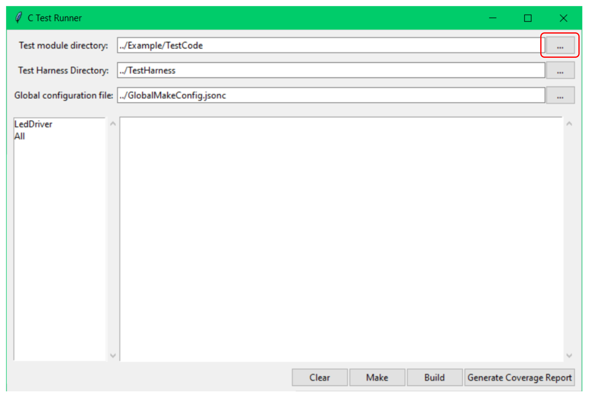
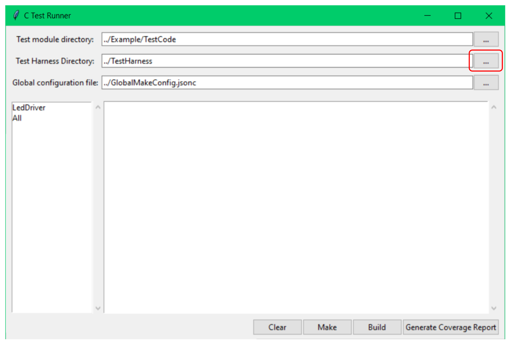
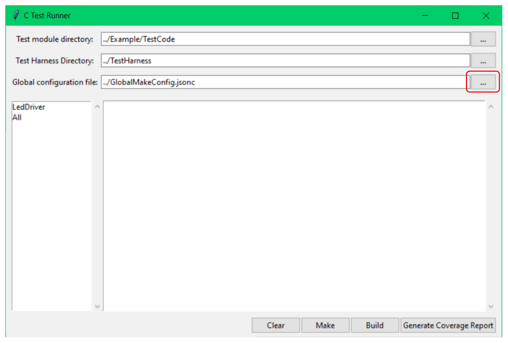
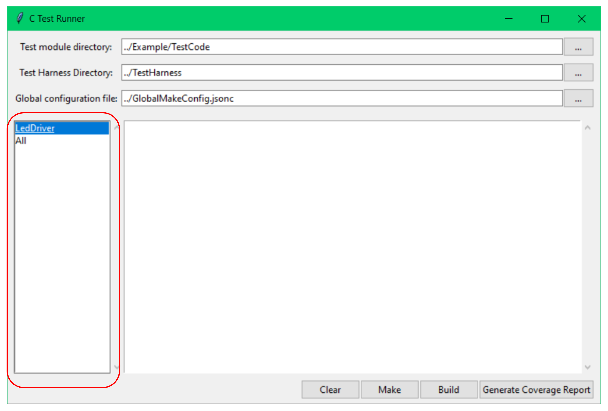
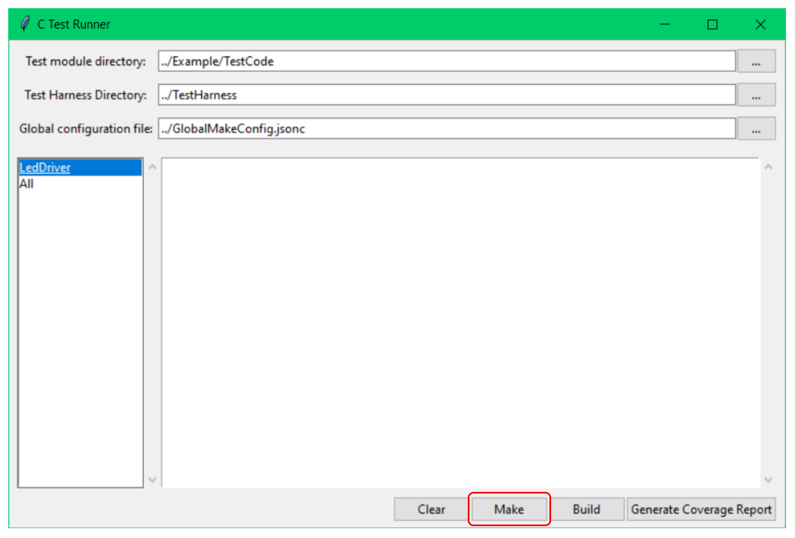

# c_test_harness

Test environment for C language projects.

# Preparing Your Test Code

Refer to the "Example" folder for a demonstration of the directory structure.

Within the "Example" folder, you'll find "ProductCode" and "TestCode" directories. The "ProductCode" directory represents the location of your source code that you intend to test. "TestCode" contains the testing code designed to verify the functionality of the code in "ProductCode". While "TestCode" is used in the example, you can choose any name you prefer for your test directory.

To set up your test environment:

Within your chosen test directory (e.g., "TestCode"), create subdirectories for each module you want to test independently.

Let's say you want to test a module named `<module>`.

1.  Create a directory named `<module>`.
2.  Inside the `<module>` directory, create the following files: `<module>Test.cpp`, `<module>TestRunner.cpp`, and `MakeConfig.jsonc`.

# Executing Tests

1.  Launch the GUI by running the following command:
    ```bash
    cd <path_to_this>/Tools
    python c_test_runner.py
    ```

2.  In the GUI, select the "Test module directory". This is the directory you prepared in the previous steps (e.g., the "TestCode" directory).
    

3.  Select the "Test Harness Directory". This is always the "TestHarness" folder located in the same directory as this `README.md` file.
    

4.  Select the "Global configuration file". This is the "GlobalMakeConfig.jsonc" file, also located in the same directory as this `README.md` file.
    

5.  You will now see a list of the modules you've configured for testing. Select the specific module you want to test.
    

6.  Click the "Make" button to compile and run the tests.
    